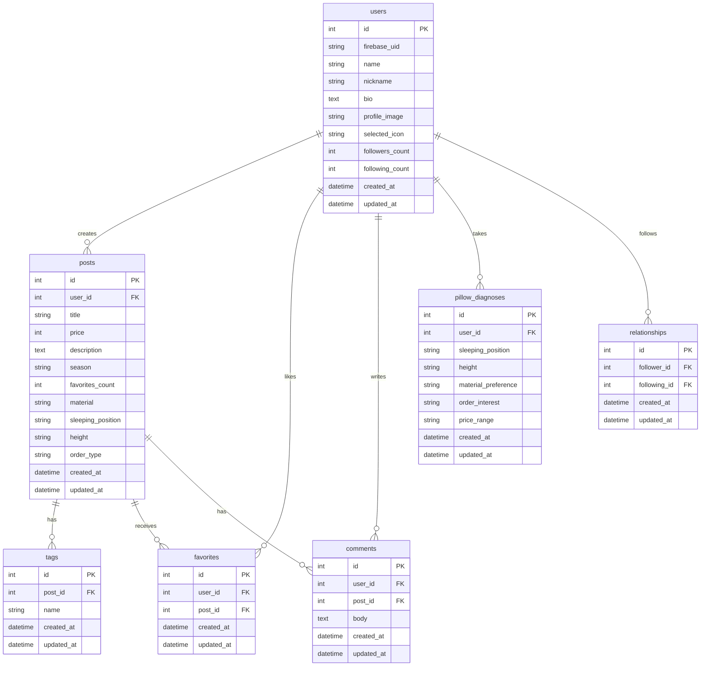

# ◆ はじめに

はじめまして！yoiteteと申します。

リポジトリをご覧いただきありがとうございます。

こちらはポートフォリオの**バックエンド**側のリポジトリです。
（フロントエンドのリポジトリは[こちら](https://github.com/yoitete/mokomoko_front)です。)

#### ポートフォリオは以下からアクセスできます↓

https://moko-moko.link/home

## 1.ポートフォリオの紹介

### (1) 概要

- "MokoMoko"は、自分のお気に入りの枕を写真付きで投稿し、ほかのユーザーと共有できるレビュープラットフォームです。
- 枕診断や検索機能を使って、自分に合った理想の枕を見つけることができます。

---

### (2) 使用イメージ

- 「投稿ページ」
  - お気に入りの枕を写真付き（最大5枚）で紹介し、素材や寝心地などの感想を投稿できる機能です。

- 「検索ページ」
  - タグ（`#低反発` `#オーダーメイド` など）やキーワードから理想の枕を探せます。
  - 並べ替え機能（新着順・人気順・おすすめ順）で、自分の好みに合った投稿を見つけやすくなっています。

- 「枕診断」
  - 寝姿勢・身長・素材の好み・予算などの質問に答えるだけで、自分に合った枕の投稿をおすすめしてくれる機能です。
  - 診断結果はマッチ度（%）で表示され、検索ページの「おすすめ順」にも反映されます。

- 「お気に入りページ」
  - 気になった投稿をお気に入りに保存し、いつでもすぐに見返せる機能です。

- 「コメント機能」
  - 投稿に対してコメントを送ることができ、ユーザー同士で枕の使用感について情報交換ができます。

- 「フォロー機能」
  - 気になるユーザーをフォローし、そのユーザーのプロフィールや投稿をチェックしやすくなります。

- 「閲覧履歴」
  - 過去に閲覧した投稿が自動で記録され、あとから見返したいときにすぐにアクセスできます。

### (3) サービス開発の背景

- 私は睡眠の質に関心があり、身近にも睡眠不足や枕選びに悩んでいる人が多くいました。枕は素材・高さ・硬さなど選ぶ基準が多いにもかかわらず、実際の寝心地を事前に比較できる情報は限られています。店頭で少し試しただけでは自分に合うかわからず、購入後に後悔した経験もあります。

- 「自分と体型や寝姿勢が近い人のリアルな感想が見られたら、枕選びはもっと楽になるのでは？」──身近な人たちの悩みを目の当たりにする中でそう考え、ユーザー同士が写真や感想を投稿・共有し、自分に合った枕を見つけられるレビュープラットフォームを開発しました。

- サービス名の **”MokoMoko”** は、枕に顔をうずめたときの”もこもこ”とした心地よさに由来しています。 **「もこもこで見つける小さな幸せ」** というサブタイトルには、毎日の眠りの中にある小さな心地よさに気づいてほしいという想いを込めています。

---

### （４） 使用技術

1. **フロントエンド**

- React\_[ver.19.0.0]
- Next.js\_[ver.15.5.3]
- TypeScript\_[ver.5.x]
- TailwindCSS（スタイリング）
- SWR（データフェッチング）
- Axios（HTTP通信）

2. **バックエンド**

- Ruby on Rails\_[ver.8.0.2]（APIモード）
- MySQL
- Rubocop（コード整形）
  　

4. **開発環境**

- Docker / Docker Compose
  　

5. **インフラ**

- AWS（ECS Fargate、RDS、S3、VPC Endpoint）
- GitHub Actions（CI/CD）
- AWS CloudWatch（監視）
  　

6. **セキュリティ**

- Firebase Authentication（ユーザー認証）

---

### (5) 主な実装機能

- **投稿作成・編集**
  - 画像登録（最大5枚）
  - タイトル・説明・価格の入力
  - 枕の属性選択（素材・寝姿勢・身長・オーダータイプ）
  - タグ追加（制限なし）
  - 自分の投稿は編集・削除が可能

- **検索・並べ替え**
  - キーワード検索（タグ・タイトル・説明を横断して検索）
  - タグクリックで関連投稿への遷移
  - 並べ替え機能（新着順・人気順・おすすめ順）

- **枕診断**
  - 寝姿勢・身長・素材の好み・オーダーへの興味・予算の5問に回答
  - 診断結果に基づき、マッチ度（%）付きで投稿をおすすめ表示
  - 検索ページの「おすすめ順」にも診断結果が反映
  - 診断履歴の保存・過去の診断結果の復元が可能

- **投稿詳細**
  - 画像カルーセル表示（複数画像の場合、左右ナビ＋ドットインジケーター）
  - 枕の特性をレーダーチャートで5軸に可視化
  - コメント投稿・閲覧機能
  - お気に入りボタン
  - 投稿者プロフィールへのリンク
  - 投稿日時表示

- **ホームページ**
  - 新着投稿の表示（最新6件）
  - 人気ランキング（お気に入り数の上位、上位3件に王冠表示）
  - 枕診断への導線

- **お気に入り**
  - 1投稿に対し、1ユーザーにつき1つまで登録可能
  - お気に入り総数を表示
  - お気に入り一覧からの閲覧（ページネーション対応）

- **フォロー・フォロワー**
  - 他ユーザーのフォロー・フォロー解除
  - フォロー数・フォロワー数の表示
  - フォロー・フォロワー一覧の閲覧

- **閲覧履歴**
  - 閲覧した投稿を自動で記録
  - 個別削除・一括クリアが可能

- **ユーザープロフィール**
  - 他ユーザーのプロフィール（ニックネーム・自己紹介・投稿一覧）の閲覧
  - フォローボタン

- **マイページ**
  - プロフィール編集（アイコン・ニックネーム・自己紹介・プロフィール画像）
  - アカウント設定（ユーザー名・メールアドレスの変更）
  - パスワード変更
  - 自分の投稿一覧の管理（編集・削除）

- **ユーザー認証（Firebase）**
  - メールアドレスとパスワードはFirebase上で管理し、セキュリティを強化
  - メール認証（新規登録・ログイン）
  - ゲストログイン機能

---

### (6) 構成図など

#### 1. インフラ構成図

#### 2. ER図

# ER Diagram

#### 3.当初のデザイン案（figma）

---

### (7) 特にこだわった点

- ユーザーが直感的に操作できるよう、操作説明がなくても迷わず使えるUI/UXを目指し、何度も修正と検証を重ねた。
- UI全体から「癒し」を感じられる空間を演出するため、色合いやフォントの統一感を持たせた。
- 枕診断機能では、診断結果をもとに検索のおすすめ順にも反映させることで、ユーザーが自分に合った枕を自然に見つけられる体験を設計した。
- 投稿詳細のレーダーチャートにより、枕の特性を視覚的に比較しやすくした。

---

## 2. 技術の選定

技術選定で意識したことと、主な技術の選定理由は以下の通りです。

### （１） 意識したこと

- **モダンな技術を採用する。**
  - Web業界は次々と新しい技術が登場するため、常にキャッチアップが欠かせない。
    そのため、基盤となるモダンな技術を学ぶことが、新しい技術に柔軟に順応する力の習得につながると考えている。
  - また、モダンな技術は今後さらに開発現場での採用が進むと予想される。
    より実践に近い技術を学ぶことで、早い段階から現場で活かせる力の獲得を目指している。
  　
- **情報が多く学びやすい技術を採用する。**
  - プログラミング初学者はエラーなどにつまずくことが多い。
    情報が豊富な技術を選ぶことで、自己解決が容易になり、学習や開発のハードルを下げられると判断した。
  - さらに、多くの開発者に利用されている技術であれば、周辺ツールやライブラリも充実しており、開発効率の向上も期待できる。

---

### （２） 主な技術の選定理由

1. **フロントエンド**

### **React / Next.js**

- **使用用途**: フロントエンドのライブラリおよびフレームワークとして使用。SPAで運用
- **比較対象**: Vue.js / Nuxt.js
- **採用理由**:
  - Reactはコンポーネントベースの開発が可能で再利用性が高い
  - コンポーネントの親子関係が明確で、Vue.jsと比較しても大規模なアプリケーションでも管理がしやすい
  - Next.jsはファイルベースルーティングが可能で効率的に開発可能な他、SSRでの運用等も可能となる
  - 今回はユーザーにストレスフリーでスムーズな操作性を目的としたため、差分レンダリングであるSPAで運用している

### **TypeScript**

- **使用用途**: フロントエンドの開発言語
- **比較対象**: JavaScript
- **採用理由**:
  - 既存のJavaScriptコードをそのまま利用することができる上で、静的型付けが可能
  - 変数や関数の型を事前に指定することで、バグの早期発見やコードの可読性や安全性が向上する
  - 大規模なアプリケーション開発において、型安全性により保守性が向上する

### **TailwindCSS**

- **使用用途**: CSSフレームワークとして使用
- **比較対象**: Bootstrap、Material-UI
- **採用理由**:
  - 事前に定義された多くのクラスを使用することで、開発効率が向上する
  - カスタマイズ性と柔軟性が高いため、あらゆるデザインに対応できる
  - ユーティリティファーストのアプローチにより、一貫したデザインシステムを構築できる
  - バンドルサイズの最適化により、不要なCSSが含まれない

### **SWR**

- **使用用途**: データフェッチングライブラリ
- **比較対象**: React Query、Apollo Client
- **採用理由**:
  - シンプルなAPIでキャッシュ機能を提供
  - リアルタイムデータ同期やエラーハンドリングが容易
  - 軽量で学習コストが低い

### **Axios**

- **使用用途**: HTTPクライアントライブラリ
- **比較対象**: Fetch API、jQuery.ajax
- **採用理由**:
  - リクエスト/レスポンスのインターセプト機能
  - 自動的なJSONデータ変換
  - ブラウザ互換性が高い

### **Firebase**

- **使用用途**: 認証サービス
- **比較対象**: Auth0、AWS Cognito
- **採用理由**:
  - 簡単に認証機能を実装できる
  - Google認証など、SNS認証の統合が容易
  - 無料プランで十分な機能を提供

## 2. バックエンド

### **Ruby / Ruby on Rails**

- **使用用途**: バックエンドの開発言語とフレームワークとして使用（APIモードで運用）
- **比較対象**: Go、Python/Django、PHP/Laravel、Node.js/Express
- **採用理由**:
  - MVCモデルに基づいており、データベースの操作も容易で、効率的に開発が可能
  - Convention over Configurationの思想により、開発速度が向上する
  - 豊富なGemライブラリにより、機能拡張が容易
  - Active Recordにより、データベース操作が直感的
  - インターネット教材が豊富なことから情報も習得しやすい

### **MySQL**

- **使用用途**: リレーショナルデータベース
- **比較対象**: PostgreSQL、SQLite
- **採用理由**:
  - Railsとの親和性が高い
  - 安定性とパフォーマンスのバランスが良い
  - AWS RDSでの運用が容易

## 3. コンテナ・開発環境

### **Docker / Docker Compose**

- **使用用途**: バックエンドの開発環境および本番環境の構築
- **比較対象**: VirtualBox、直接インストール
- **採用理由**:
  - Dockerは他の端末でも同じ開発環境を容易に再現することが可能
  - VirtualBoxと比較して、コンテナ化技術によりOS等の環境差異による問題や手間を減らすことが可能
  - より軽量で素早く起動することができる
  - Docker ComposeはバックエンドのRailsと開発環境でのデータベース（MySQL）など、複数コンテナの一括管理が可能

## 4. インフラ

※ 以下の理由から、主にAWS（Amazon Web Services）サービスを採用した。

- GCPと比較してインターネット上で実装に関する情報が豊富
- RenderやHerokuでは読み込み速度が遅い
- AWSは幅広いサービスを提供しており、他のサービスとの親和性が高く、一元的な管理が可能

### **ECS Fargate**

- **使用用途**: バックエンドのサーバー（バックエンドのコンテナ(Docker)をデプロイ・管理）
- **比較対象**: EC2、AWS Lambda
- **採用理由**:
  - ECR上に保持したコンテナ(Docker)をそのままデプロイ可能
  - EC2と比較して、サーバーに必要なリソース(処理能力やメモリなど)をAWSが自動的に調整してくれるため、手動でのサーバー管理の必要が無い
  - サーバーレスコンテナとして、スケーリングが自動化されている
  - 運用コストを抑えながら、高い可用性を提供

### **AWS RDS**

- **使用用途**: マネージドデータベースサービス
- **比較対象**: EC2上でのMySQL自運用
- **採用理由**:
  - 自動バックアップとポイントインタイム復旧
  - 自動スケーリングとパフォーマンス最適化
  - セキュリティパッチの自動適用
  - 高可用性のMulti-AZ配置

### **AWS S3**

- **使用用途**: ファイルストレージ（Active Storage用）
- **比較対象**: ローカルストレージ、Google Cloud Storage
- **採用理由**:
  - 高い耐久性と可用性
  - Rails Active Storageとの統合が容易
  - CDNとの連携による高速配信
  - コスト効率が良い

### **GitHub Actions**

- **使用用途**: バックエンドのCI/CDパイプライン
- **比較対象**: CircleCI、Jenkins
- **採用理由**:
  - バックエンドのプッシュからデプロイまでを自動化できる
  - GitHub Actionsのみ制限無しで無料利用が可能（パブリックレポジトリの場合）
  - GitHubリポジトリと直接統合されていて、管理しやすい
  - ECS Fargateへの自動デプロイが容易

### **AWS VPC Endpoint**

- **使用用途**: プライベートネットワーク経由でのAWSサービスアクセス
- **採用理由**:
  - インターネットを経由せずにAWSサービスにアクセス可能
  - セキュリティの向上
  - データ転送コストの削減
  - ネットワークレイテンシの削減

## 5. 運用・監視

### **AWS CloudWatch**

- **使用用途**: ログ収集・監視
- **採用理由**:
  - AWSサービスとの統合が容易
  - アラート設定による障害の早期発見
  - コスト効率の良い監視ソリューション

ここまでお読みいただきありがとうございます。
少しでも興味を持っていただけたら幸いです。
